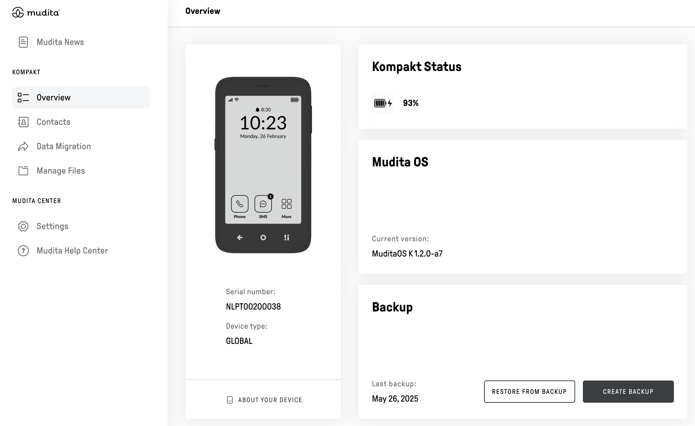

# Mudita Center

Mudita Center allows you to expand and update the features of Mudita Pure, while using your computer. Update [MuditaOS](https://github.com/mudita/MuditaOS/), synchronise calendar and contacts, upload audio, use Pure as a mobile hotspot. One application for every platform, open-sourced for transparency.

Mudita Center is written in Node.js and distributed as an Electron app.

## Key features

- updating MuditaOS
- creating backups
- recovery mode
- synchronizing calendar and contacts with Google and Apple
- managing contacts, messages, notes, events from your desktop
- uploading audio files
- enabling using Mudita Pure as a mobile hotspot
- managing files
- viewing meditation stats
- Windows, macOS, Linux support

## Table of contents

* [Quickstart](#Quickstart)
* [Contributing](#Contributing)
   * [Discussions](#Discussions)
   * [Reporting issues and feature requests](#Reporting-bugs-and-feature-requests)
   * [Development workflow](#Development-workflow)  
* [License](#license)

## Quickstart

You can quickstart the project by going through the ["Quickstart" article](./quickstart.md).

## Contributing

Pull requests are welcome. Please follow the guidelines in the ["Contributing to Mudita Center"](./CONTRIBUTING.md) article. Before contributing or starting a discussion, please make sure that you read our [Code of Conduct](./CODE_OF_CONDUCT.md).

### Discussions

For general questions and ideas regarding Mudita Center please post in the [“???” section on Mudita Forum](???). Please explore all existing posts to make sure you’re not posting about an issue that has already been discussed.

### Reporting bugs and feature requests

You can report bugs and feature requests on [GitHub](https://github.com/#/issues). This is also a good place to discuss architecture decisions and things that aren’t yet covered by the documentation. Please refer to the ["Contributing to Mudita Center"](./CONTRIBUTING.md) article for more details.

### Development workflow

When contributing code or documentation changes please follow the guidelines inside the ["Development workflow"](./development_workflow.md) article.

## Changelog

The [Mudita Center changelog](./changelog.md) is regularly updated by the core development team.

## License
Mudita Center is licensed on [???](https://choosealicense.com/licenses/???/)